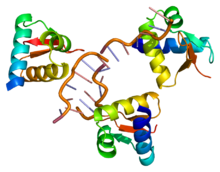

# RNA-binding Protein Database 

This database was developed as part of studies in Database Management during the pursuit of a degree in Bioinformatics. It is designed to store information about proteins that have the ability to bind to RNA, which is of great importance in understanding molecular-level biological processes.

## Detailed Report

For more details about this project and to explore the detailed report, please visit [the report](https://justog220.github.io/TIF-BD/Informe.pdf).

## Contributions and Collaborations
The scientific community is encouraged to contribute to this database! If you have additional information about RNA-binding proteins or wish to collaborate on improving the database, please feel free to contact the project administrator.

## Contact
If you have any feedback or want more information about this work, reach me at justogarciapc@gmail.com
